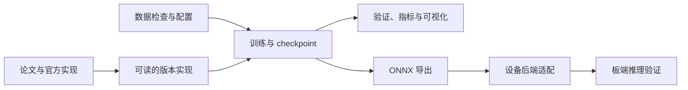

<div align="center">

<h1></h1>

**从论文，到训练，再到板端部署。**

X-DeT 是面向目标检测学习、研究与落地的 PyTorch 项目。我们持续跟进目标检测论文，把模型结构、训练目标和推理流程落实为可阅读、可训练、可验证的实现，并逐步补齐 ONNX 与不同边缘设备的部署适配。


[项目路线](#项目路线) · [支持版本](#支持版本) · [计划中的检测器](#计划中的检测器) · [快速开始](#快速开始) · [训练与可视化](#训练与可视化) · [学习文档](#学习文档)

</div>

---

## 项目特点

| | 能做什么 |
|---|---|
| 📚 **读论文、看代码** | 按论文拆解主干、特征融合、检测头、标签分配、损失和后处理，并标清工程差异。 |
| 🧱 **训练与评估** | 提供模型专属的训练、验证、推理流程；用统一数据和指标开展可追溯的版本对比。 |
| 📊 **分析实验** | 生成训练曲线、数据集分布、定量评估和预测可视化，帮助从证据定位问题。 |
| 🔌 **适配部署** | 逐步建立 ONNX、TensorRT、RKNN 等导出和推理链路，并在目标设备上验证。 |
| 🧪 **接入新方法** | 可以沿用清楚的论文版本边界添加新检测器、骨干或训练方法，并保留来源和实验依据。 |



## 项目路线

X-DeT 从 YOLO 系列实现起步，方向扩展到更广泛的目标检测研究。每种方法都沿着“论文理解 → 模型实现 → 训练与评估 → 推理与导出 → 设备验证”记录代码、配置和实测结果。持续跟进新论文时，会明确区分已实现、实验中和规划中的能力。

| 环节 | 当前状态 | 后续建设 |
|---|---|---|
| 模型与论文 | YOLOv1、YOLOv2、YOLOv3 有独立 PyTorch 实现 | 持续跟进新的检测论文，保留各方法自己的结构与训练语义 |
| 数据、训练、评估 | 支持 YOLO TXT 数据和对应训练/验证流程，已有曲线、数据分析与预测可视化工具 | 扩充数据格式适配和跨版本可复现实验记录 |
| 模型导出 | 目前以 PyTorch 为主 | 建立 ONNX 导出与 PyTorch 输出对比流程 |
| 边缘部署 | TensorRT、RKNN 等板端链路尚未在本项目验证 | 按具体设备和工具链逐项接入，记录精度、延迟、吞吐和环境 |

目标设备的转换与推理必须分别记录具体型号、工具链版本、输入预处理、数值精度和对照结果；某个平台跑通不代表其他平台已经支持。

## 支持版本

| 版本 | 关键设计 | 当前实现 | 训练配置 |
|---|---|---|---|
| **YOLOv1** | 网格预测、每格两个框、平方误差 | 原始风格模型；另有 TorchVision 骨干迁移变体 | [`configs/yolov1/`](configs/yolov1/) |
| **YOLOv2** | Anchor boxes、Darknet-19、passthrough 特征 | 独立标签分配、损失、解码和 NMS | [`configs/yolov2/voc0712.yaml`](configs/yolov2/voc0712.yaml) |
| **YOLOv3** | Darknet-53、残差块、三尺度预测、独立 sigmoid 分类 | 三尺度标签分配、Darknet 风格损失、解码和 NMS；可选 ConvNeXt-Small ImageNet 预训练骨干 | [`configs/yolov3/`](configs/yolov3/) |

YOLOv2 可显式加载 Darknet-19 ImageNet 分类权重初始化 backbone，检测层仍从头训练；不会自动下载权重。完整范围和与论文的差异见 [YOLOv2 版本说明](docs/versions/yolov2.md)。

YOLOv3 默认路径可加载 Darknet-53 ImageNet 分类权重，保留论文骨干；另有 ConvNeXt-Small + YOLOv3 neck/head 的工程变体，使用 TorchVision ImageNet-1K 分类预训练。两个配方和它们与论文/官方实现的差异见 [YOLOv3 版本说明](docs/versions/yolov3.md)。

在 VOC 2007 test 上，当前 YOLOv2 配方达到 mAP50 `0.694`、mAP50:95 `0.394`；同一评估流程下的 YOLOv1 基线分别为 `0.688` 和 `0.318`。逐类比较、训练图表和可用 checkpoint 见 [YOLOv2 与 YOLOv1 实验报告](docs/reports/yolov2_voc0712_vs_yolov1_20261005.md)。

## 计划中的检测器

下列方法尚未作为 X-DeT 模型实现。当前 YOLOv3 实验完成后，将基于同一 VOC 数据划分逐个实现、训练和评估；各自保留有代表性的结构与训练配方，并统一报告 VOC AP50、AP50:95、训练曲线和预测可视化。具体实施边界和参考版本见[检测器路线说明](docs/roadmap/detectors.md)。

| 方法 | 状态 | 计划实现重点 | 参考实现 |
|---|---|---|---|
| **RTMDet（水平框）** | 计划中 | CSPNeXt + PAFPN、多尺度 anchor-free 检测头、Dynamic Soft Label Assigner、Quality Focal Loss 与 GIoU；保留 Mosaic/MixUp、EMA 和末段关闭强增强等配方要点 | [MMDetection RTMDet 配置](https://github.com/open-mmlab/mmdetection/blob/cfd5d3a985b0249de009b67d04f37263e11cdf3d/configs/rtmdet/rtmdet_s_8xb32-300e_coco.py) |
| **FCOS** | 计划中 | ResNet-FPN 多层级逐点预测、LTRB 距离回归、centerness 分支、Focal Loss 与 IoU Loss；显式讲清点分配、尺度范围和解码 | [MMDetection FCOS 配置](https://github.com/open-mmlab/mmdetection/blob/cfd5d3a985b0249de009b67d04f37263e11cdf3d/configs/fcos/fcos_r50-caffe_fpn_gn-head_1x_coco.py) |
| **RTMDet-R2（旋转框）** | 后续研究方向 | 在标准 RTMDet 完成后再考虑；这是面向遥感旋转框的扩展，包含角度回归与旋转 IoU，和本表中的水平框 RTMDet 任务不同 | [RTMDet-R2 参考仓库](https://github.com/Zeba-Xie/RTMDet-R2) |

参考仓库固定在本地 `3dparty/` 中的提交及许可证、论文来源和实施边界记录在[检测器路线说明](docs/roadmap/detectors.md)。参考代码用于理解和对照；X-DeT 的实现会放在本仓库并自行验证，不把 MMDetection 当作默认运行依赖。

## 快速开始

### 1. 安装环境

项目依赖 PyTorch、TorchVision（部分骨干变体使用）、NumPy、Pillow、PyYAML 和 Matplotlib。先根据操作系统和 CUDA 环境安装匹配版本的 PyTorch 与 TorchVision，再安装其余依赖：

```bash
# 按本机 CUDA / CPU 环境选择匹配的 PyTorch 与 TorchVision 安装命令
# https://pytorch.org/get-started/locally/
python -m pip install -r requirements.txt
```

### 2. 准备数据

数据使用 YOLO TXT：每张图片对应一个同名 `.txt`，每行格式为 `class_id x_center y_center width height`，坐标和宽高均归一化到 `[0, 1]`。类别编号顺序由数据集 YAML 中的 `class_names` 决定。

```text
my_dataset/
├── images/
│   ├── train/
│   └── val/
└── labels/
    ├── train/
    └── val/
```

先检查图片/标签配对、类别编号和标注范围：

```bash
python scripts/inspect_dataset.py \
  --config configs/datasets/voc0712_trainmix.yaml \
  --root /path/to/yolo_voc2007_2012_trainmix \
  --grid-size 13
```

自定义数据集时，复制并修改 [`configs/datasets/voc0712_trainmix.yaml`](configs/datasets/voc0712_trainmix.yaml) 中的类别名和 split 路径，然后将该配置写入对应训练 recipe。

### 3. 训练 YOLOv2

```bash
python scripts/train_yolov2.py \
  --dataset-root /path/to/yolo_voc2007_2012_trainmix \
  --pretrained-darknet weights/yolov2/darknet19_448.weights \
  --device cuda \
  --output runs/yolov2/experiment-001
```

上面的预训练文件可从 [官方 Darknet ImageNet 页面](https://pjreddie.com/darknet/imagenet/)获取：

```bash
mkdir -p weights/yolov2
curl -fL https://pjreddie.com/media/files/darknet19_448.weights \
  -o weights/yolov2/darknet19_448.weights
```

该文件 SHA256：`77bd0b33f92522a97d6667c5d6cb118d4928bec40f21872f5b4965231ac2167b`。

这是 ImageNet 分类权重，不是检测器 checkpoint。训练入口只在显式传入 `--pretrained-darknet` 时加载它；前 18 个 Darknet-19 特征卷积块使用预训练值，检测专属层仍随机初始化。`weights/` 已加入忽略列表，不会提交到 Git。默认 recipe 为 165 epochs、416×416 输入、有效 batch 64，每 10 个 epoch 保存 `last.pt`；验证指标刷新时保存 `best.pt`。这套 PyTorch 配方是教学型工程实现，不代表官方完整复现。训练可从 `last.pt` 恢复：

```bash
python scripts/train_yolov2.py \
  --dataset-root /path/to/yolo_voc2007_2012_trainmix \
  --resume runs/yolov2/experiment-001/last.pt \
  --device cuda
```

### 4. 训练 YOLOv3

YOLOv3 使用 Darknet-53 分类预训练权重初始化主干。先从 [官方 Darknet 权重](https://pjreddie.com/media/files/darknet53.conv.74)下载到本地，再明确传给训练入口：

```bash
mkdir -p weights/yolov3
curl -fL https://pjreddie.com/media/files/darknet53.conv.74 \
  -o weights/yolov3/darknet53.conv.74

python scripts/train_yolov3.py \
  --dataset-root /path/to/yolo_voc2007_2012_trainmix \
  --pretrained-darknet53 weights/yolov3/darknet53.conv.74 \
  --device cuda \
  --output runs/yolov3/voc0712-darknet53
```

训练配置为 416 输入、有效 batch 64、最多 200 epochs；每 10 个 epoch 保存可恢复检查点，验证指标最优时更新 `best.pt`。本项目固定输入尺寸与数据集 loader 的拉伸预处理，和 Darknet 官方随机多尺度/letterbox 流程有差异，详见 [YOLOv3 版本说明](docs/versions/yolov3.md)。

也可运行 ConvNeXt-Small 预训练主干变体。权重由 TorchVision 按 recipe 显式指定的 `IMAGENET1K_V1` 初始化：

```bash
python scripts/train_yolov3.py \
  --dataset-root /path/to/yolo_voc2007_2012_trainmix \
  --recipe configs/yolov3/voc0712_convnext_small.yaml \
  --device cuda \
  --output runs/yolov3/voc0712-convnext-small
```

YOLOv1 使用 [`scripts/train_yolov1.py`](scripts/train_yolov1.py) 和 `configs/yolov1/` 中的 recipe。默认训练设置与版本说明见 [YOLOv1 文档](docs/versions/yolov1.md)。

## 训练与可视化

### 评估与单图推理

```bash
python scripts/evaluate_yolov2.py \
  --dataset-root /path/to/yolo_voc2007_2012_trainmix \
  --checkpoint runs/yolov2/experiment-001/best.pt \
  --split val --device cuda

python scripts/infer_yolov2.py path/to/image.jpg \
  --checkpoint runs/yolov2/experiment-001/best.pt --device cuda

python scripts/evaluate_yolov3.py \
  --dataset-root /path/to/yolo_voc2007_2012_trainmix \
  --checkpoint runs/yolov3/voc0712-darknet53/best.pt \
  --split val --device cuda

python scripts/infer_yolov3.py path/to/image.jpg \
  --checkpoint runs/yolov3/voc0712-darknet53/best.pt --device cuda
```

### 实验图表

```bash
# 训练损失、验证 AP、学习率
python scripts/plot_training_curves.py \
  --run-dir runs/yolov2/experiment-001

# 类别分布、框尺寸、目标中心和网格中心碰撞
python scripts/plot_dataset_analysis.py \
  --config configs/datasets/voc0712_trainmix.yaml \
  --dataset-root /path/to/yolo_voc2007_2012_trainmix \
  --output-prefix runs/yolov2/experiment-001/dataset_analysis \
  --grid-size 13

# 验证集真值框与模型预测对照图、contact sheet 和 manifest
python scripts/visualize_yolov2_predictions.py \
  --recipe configs/yolov2/voc0712.yaml \
  --dataset-root /path/to/yolo_voc2007_2012_trainmix \
  --checkpoint runs/yolov2/experiment-001/best.pt \
  --output-dir runs/yolov2/experiment-001/predictions \
  --split val --device cuda

python scripts/visualize_yolov3_predictions.py \
  --recipe configs/yolov3/voc0712.yaml \
  --dataset-root /path/to/yolo_voc2007_2012_trainmix \
  --checkpoint runs/yolov3/voc0712-darknet53/best.pt \
  --output-dir runs/yolov3/voc0712-darknet53/predictions \
  --split val --device cuda
```

训练曲线输出 PNG/SVG；数据分析输出 PNG/SVG/JSON；预测可视化输出逐图对照图、contact sheet 和 JSON manifest。网格碰撞图统计的是目标中心落在同一格，不等于 YOLOv2 的 cell/anchor 分配冲突。

## 项目结构

```text
X-DeT/
├── configs/                 # 按版本保存训练 recipe 和数据集定义
├── docs/
│   ├── versions/            # 论文与版本实现说明
│   ├── experiments/         # 有控制变量的实验记录
│   └── reports/             # 训练、评估和诊断报告
├── scripts/                 # 训练、评估、推理、分析和可视化入口
├── x_yolo/
│   ├── models/yolov1/       # YOLOv1 专属模型、损失和后处理
│   ├── models/yolov2/       # YOLOv2 专属模型、损失和后处理
│   ├── models/yolov3/       # YOLOv3 专属模型、损失和后处理
│   ├── data/                # YOLO TXT 数据读取与增强
│   ├── training/            # 训练循环和 checkpoint
│   └── evaluation/          # 检测指标
├── tests/                   # 模型、数据和流程检查
├── data/                    # 本地数据（不提交）
└── runs/                    # checkpoint、指标和图表（不提交）
```

当前 Python 源码目录沿用 `x_yolo/` 命名，模型按算法版本独立组织；训练与部署公共部分只在实际形成稳定共性后再抽取。

## 参考实现

开发工作区的 `3dparty/` 中保留两份独立上游检出，用于阅读成熟训练、数据、评估和部署流程；它们不是 X-DeT 的运行依赖，也不随本仓库发布。上游源码和固定版本如下：

| 项目 | 可参考内容 | 本地参考版本 | 许可 |
|---|---|---|---|
| [MMDetection](https://github.com/open-mmlab/mmdetection) | 训练/测试、数据集定制、模型组件和部署文档 | [`cfd5d3a`](https://github.com/open-mmlab/mmdetection/commit/cfd5d3a985b0249de009b67d04f37263e11cdf3d) | Apache-2.0 |
| [RTMDet-R2](https://github.com/Zeba-Xie/RTMDet-R2) | 旋转框检测、任务交互解耦头、ProbIoU 感知标签分配和 TensorRT 评估参考 | [`20cc7ac`](https://github.com/Zeba-Xie/RTMDet-R2/commit/20cc7acad5fd98ef4c344c829bb9c360798d8a86) | Apache-2.0 |

两者用于实现研究和工程对照，不是当前训练脚本的运行依赖。X-DeT 中若采用其代码或配置，应在对应版本文档中注明来源、许可和改动范围。

## 指标与复现边界

- 每种检测方法保留自己的模型输出、标签规则、损失和后处理，避免为统一接口掩盖论文差异。
- 评估输出 AP50、AP50:95 和 mAP；不同数据集、类别映射、输入预处理或 `difficult` 标注处理方式不同，数值不能直接横向比较。
- 训练 recipe、数据配置、随机种子和运行指标随 run 保存，便于回看实验设置。
- YOLOv2 提供官方 Darknet-19 ImageNet 分类权重的 backbone 加载，但不支持官方 YOLOv2 检测器 `.weights` 导入；WordTree 联合训练、动态多尺度训练和 ONNX、TensorRT、RKNN 部署链路也尚未实现。
- YOLOv3 提供 Darknet-53 论文路径和 ConvNeXt-Small 预训练主干工程变体；固定 416 输入的训练 recipe 与 Darknet 官方多尺度 schedule、jitter 增强及单图 letterbox 流程不同。
- 新增方法请单独写清来源、假设、实现差异和实验条件；对比时一次只改一个主要变量。

## 测试

```bash
python -m pytest -q
```

单步 `--max-steps` 适合检查数据、训练和保存流程，不是模型收敛或精度验证。

## 学习文档

- [YOLOv1：论文、模型、训练与实验](docs/versions/yolov1.md)
- [YOLOv2：Anchor、Darknet-19、标签分配与实现差异](docs/versions/yolov2.md)
- [YOLOv3：Darknet-53、多尺度检测头与实现差异](docs/versions/yolov3.md)
- [YOLOv3：Darknet-53 与 ConvNeXt-Small 主干对照](docs/experiments/yolov3/darknet53_vs_convnext_small.md)
- [YOLOv2 完整 VOC 训练与 YOLOv1 对比报告](docs/reports/yolov2_voc0712_vs_yolov1_20261005.md)
- [YOLOv2 实现与 smoke 验证记录](docs/reports/yolov2_implementation_smoke_20261005.md)
- [YOLOv1 实验记录](docs/experiments/yolov1/)

## License

[Apache License 2.0](LICENSE)
