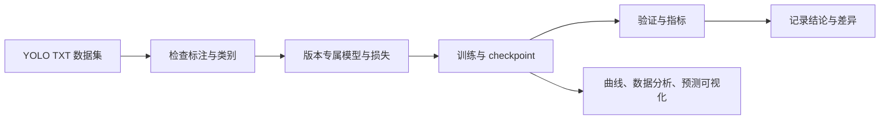

<div align="center">

# X-YOLO

**从论文到代码，逐版读懂 YOLO。**

一个面向学习与研究的 PyTorch 检测项目：把论文中的网络、标签分配、损失和推理过程，拆成能阅读、能运行、能验证的代码。


[快速开始](#快速开始) · [支持版本](#支持版本) · [训练与可视化](#训练与可视化) · [学习文档](#学习文档)

</div>

---

## 项目特点

| | 能做什么 |
|---|---|
| 📚 **读懂算法** | 逐版说明论文思路、张量形状、损失目标和工程差异。 |
| 🧱 **运行模型** | 当前包含 YOLOv1、YOLOv2 的独立模型、训练、评估和推理路径。 |
| 📊 **查看实验** | 生成训练曲线、数据集分布图、评估报告和真值/预测对照图。 |
| 🧪 **添加方法** | 可独立试验新骨干、新损失或新检测版本，并记录配置与结果。 |



## 支持版本

| 版本 | 关键设计 | 当前实现 | 训练配置 |
|---|---|---|---|
| **YOLOv1** | 网格预测、每格两个框、平方误差 | 原始风格模型；另有 TorchVision 骨干迁移变体 | [`configs/yolov1/`](configs/yolov1/) |
| **YOLOv2** | Anchor boxes、Darknet-19、passthrough 特征 | 独立标签分配、损失、解码和 NMS | [`configs/yolov2/voc0712.yaml`](configs/yolov2/voc0712.yaml) |

YOLOv2 配置使用 416 输入和 Darknet VOC anchors，但当前从随机权重开始；没有暗中下载预训练权重。完整范围和与论文的差异见 [YOLOv2 版本说明](docs/versions/yolov2.md)。

## 快速开始

### 1. 安装环境

项目依赖 PyTorch、TorchVision（部分骨干变体使用）、NumPy、Pillow、PyYAML 和 Matplotlib。先根据操作系统和 CUDA 环境安装合适的 PyTorch，再安装其余依赖：

```bash
# 按本机 CUDA / CPU 环境选择 PyTorch 安装命令
# https://pytorch.org/get-started/locally/
python -m pip install -r requirements.txt
```

### 2. 准备数据

数据使用 YOLO TXT：每张图片对应一个同名 `.txt`，每行格式为 `class_id x_center y_center width height`，坐标和宽高均归一化到 `[0, 1]`。类别编号顺序由数据集 YAML 中的 `class_names` 决定。

```text
my_dataset/
├── images/
│   ├── train/
│   └── val/
└── labels/
    ├── train/
    └── val/
```

先检查图片/标签配对、类别编号和标注范围：

```bash
python scripts/inspect_dataset.py \
  --config configs/datasets/voc0712_trainmix.yaml \
  --root /path/to/yolo_voc2007_2012_trainmix \
  --grid-size 13
```

自定义数据集时，复制并修改 [`configs/datasets/voc0712_trainmix.yaml`](configs/datasets/voc0712_trainmix.yaml) 中的类别名和 split 路径，然后将该配置写入对应训练 recipe。

### 3. 训练 YOLOv2

```bash
python scripts/train_yolov2.py \
  --dataset-root /path/to/yolo_voc2007_2012_trainmix \
  --device cuda \
  --output runs/yolov2/experiment-001
```

默认 recipe 为 165 epochs、416×416 输入、有效 batch 64，每 10 个 epoch 保存 `last.pt`；验证指标刷新时保存 `best.pt`。它是项目起始配方，不代表官方完整复现，也未包含 Darknet-19 预训练权重。训练可从 `last.pt` 恢复：

```bash
python scripts/train_yolov2.py \
  --dataset-root /path/to/yolo_voc2007_2012_trainmix \
  --resume runs/yolov2/experiment-001/last.pt \
  --device cuda
```

YOLOv1 使用 [`scripts/train_yolov1.py`](scripts/train_yolov1.py) 和 `configs/yolov1/` 中的 recipe。默认训练设置与版本说明见 [YOLOv1 文档](docs/versions/yolov1.md)。

## 训练与可视化

### 评估与单图推理

```bash
python scripts/evaluate_yolov2.py \
  --dataset-root /path/to/yolo_voc2007_2012_trainmix \
  --checkpoint runs/yolov2/experiment-001/best.pt \
  --split val --device cuda

python scripts/infer_yolov2.py path/to/image.jpg \
  --checkpoint runs/yolov2/experiment-001/best.pt --device cuda
```

### 实验图表

```bash
# 训练损失、验证 AP、学习率
python scripts/plot_training_curves.py \
  --run-dir runs/yolov2/experiment-001

# 类别分布、框尺寸、目标中心和网格中心碰撞
python scripts/plot_dataset_analysis.py \
  --config configs/datasets/voc0712_trainmix.yaml \
  --dataset-root /path/to/yolo_voc2007_2012_trainmix \
  --output-prefix runs/yolov2/experiment-001/dataset_analysis \
  --grid-size 13

# 验证集真值框与模型预测对照图、contact sheet 和 manifest
python scripts/visualize_yolov2_predictions.py \
  --recipe configs/yolov2/voc0712.yaml \
  --dataset-root /path/to/yolo_voc2007_2012_trainmix \
  --checkpoint runs/yolov2/experiment-001/best.pt \
  --output-dir runs/yolov2/experiment-001/predictions \
  --split val --device cuda
```

训练曲线输出 PNG/SVG；数据分析输出 PNG/SVG/JSON；预测可视化输出逐图对照图、contact sheet 和 JSON manifest。网格碰撞图统计的是目标中心落在同一格，不等于 YOLOv2 的 cell/anchor 分配冲突。

## 项目结构

```text
X-YOLO/
├── configs/                 # 按版本保存训练 recipe 和数据集定义
├── docs/
│   ├── versions/            # 论文与版本实现说明
│   ├── experiments/         # 有控制变量的实验记录
│   └── reports/             # 训练、评估和诊断报告
├── scripts/                 # 训练、评估、推理、分析和可视化入口
├── x_yolo/
│   ├── models/yolov1/       # YOLOv1 专属模型、损失和后处理
│   ├── models/yolov2/       # YOLOv2 专属模型、损失和后处理
│   ├── data/                # YOLO TXT 数据读取与增强
│   ├── training/            # 训练循环和 checkpoint
│   └── evaluation/          # 检测指标
├── tests/                   # 模型、数据和流程检查
├── data/                    # 本地数据（不提交）
└── runs/                    # checkpoint、指标和图表（不提交）
```

## 指标与复现边界

- 每个 YOLO 版本保留自己的模型输出、标签规则、损失和后处理，避免为统一接口掩盖论文差异。
- 评估输出 AP50、AP50:95 和 mAP；不同数据集、类别映射、输入预处理或 `difficult` 标注处理方式不同，数值不能直接横向比较。
- 训练 recipe、数据配置、随机种子和运行指标随 run 保存，便于回看实验设置。
- YOLOv2 当前没有官方 Darknet 权重加载、WordTree 联合训练、动态多尺度训练，也没有 ONNX、TensorRT 或 RKNN 部署链路；这些能力完成并验证后再加入对应入口。
- 新增方法请单独写清来源、假设、实现差异和实验条件；对比时一次只改一个主要变量。

## 测试

```bash
python -m pytest -q
```

单步 `--max-steps` 适合检查数据、训练和保存流程，不是模型收敛或精度验证。

## 学习文档

- [YOLOv1：论文、模型、训练与实验](docs/versions/yolov1.md)
- [YOLOv2：Anchor、Darknet-19、标签分配与实现差异](docs/versions/yolov2.md)
- [YOLOv2 实现与 smoke 验证记录](docs/reports/yolov2_implementation_smoke_20261005.md)
- [YOLOv1 实验记录](docs/experiments/yolov1/)

## License

[Apache License 2.0](LICENSE)
